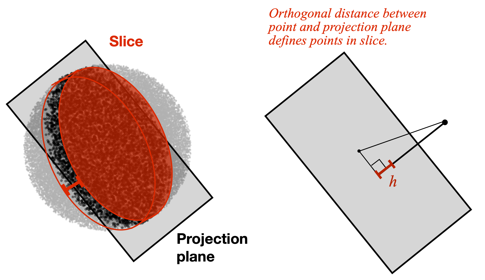

layout: false
class: split-75
background-image: url("plots/title_slide_bkg.png")
background-position: center
background-size: contain

<style type="text/css">
.remark-slide-content{
font-size: 30px;

}
code.r{
  font-size: 24px;
}

</style>

```{r setup, include=FALSE}
options(htmltools.dir.version = FALSE, width = 120)
library(tidyverse)
library(knitr)
library(kableExtra)
library(htmltools)
opts_chunk$set(
  echo = TRUE, warning = FALSE, message = FALSE, comment = "#>",
  fig.path = 'figure/', cache.path = 'cache/', fig.align = 'center',
  fig.width = 12, fig.height = 4, fig.show = 'hold',
  cache = FALSE, external = TRUE, dev = 'png', dev.args = list(bg = "transparent")
)
mp4_vid <- function(src, width){
  HTML(
    paste0(
      '<video width="', width, '" loop autoplay>
        <source src="', src, '" type="video/mp4">
      </video>'
    )
  )
}
```


```{css, echo=FALSE}
/* custom.css */
:root{
  --main-color1: #509e2f;
  --main-color2: #bcbddc;
  --main-color3: #efedf5;
  --main-color4: #9DDAE5;
  --text-color3: black;
  --text-color4: #505050;
  --code-inline-color: #4e5054;
  --link-color: #006CAB;
}
.large { font-size: 150% }
.largeish { font-size: 120% }
.summarystyle { font-size: 150%;
  line-height:150%;}
.my-gray {color: #606060!important; }
.tiny{ font-size: 25%}
```


.column[.content[

<br>

## **Section Pursuit**

**Building on projection pursuit and slicing**

.my-gray[
.large[**Ursula Laa**]

.largeish[ Institute of Statistics <br>
Department of Landscape, Spatial and Infrastructure Sciences <br>
University of Natural Resources and Life Sciences
]
]

CMStatistics 2021

]]

.column[.top_abs.content[

]]

---
# What is hidden in projections?

.pull-left[]
--

.pull-right[]

---
# Slice tour

The slice tour uses the **orthogonal distance** of each data point from a centered projection plane to define subsets of the data. Points close to the plane are **highlighted** in each projected view and can be compared to the overall (projected) distribution of points.

.center[]


---
layout: false
background-image: url("plots/title_slide_bkg.png")
background-position: center
background-size: contain

# Thanks!

<br>

This is joint work done in collaboration with **Dianne Cook** and **Stuart Lee**.


My slides are made using `RMarkdown`, `xaringan` and the `ninjutsu` theme.
The main `R` packages used are `tourr`, `tidyverse`, `plotly`, `geozoo`.

---


